## I.作业1

## 1.激活函数类型以及优缺点分析

从本质上来说，激活函数是通过非线性变换的叠加（或作用）而突破线性模型的表达能力瓶颈。因为线性模型如果不施加非线性特性最终其表达都会是一个线性模型，瓶颈无法突破。

即
$$
y = W_L(W_{L-1}(...(W_2(W_1x+b_1)+b_2)...)+b_{L-1})
$$
上式等效于下式：
$$
y =W_{total}x+b_{total}
$$
此时仍然是线性变换，无法拟合异或（XOR）等非线性可分问题。

而引入非线性激活函数就可以使得线性变化变成非线性变换，**突破模型表达能力瓶颈**；下面则是不同的激活函数以及优缺点分析：

### Sigmoid

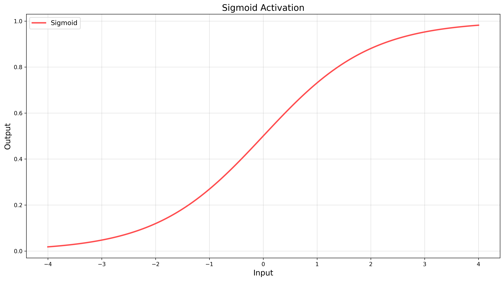

**公式**:  
$$
\sigma(x) = \frac{1}{1 + e^{-x}}
$$
Sigmoid函数在神经网络中主要用于输出层的二分类问题，将神经网络的输出映射到(0,1)之间的概率值，便于进行分类决策。

**优点**:

- 输出值域 (0,1)，适合概率场景
- 导数为 $\sigma'(x) = \sigma(x)(1-\sigma(x))$，计算简单

**缺点**:

- Sigmoid函数存在梯度饱和问题，当输入较大或较小时，梯度会接近于零，导致梯度消失，影响网络的训练。
- 输出非零中心化，导致参数更新效率低


### Tanh

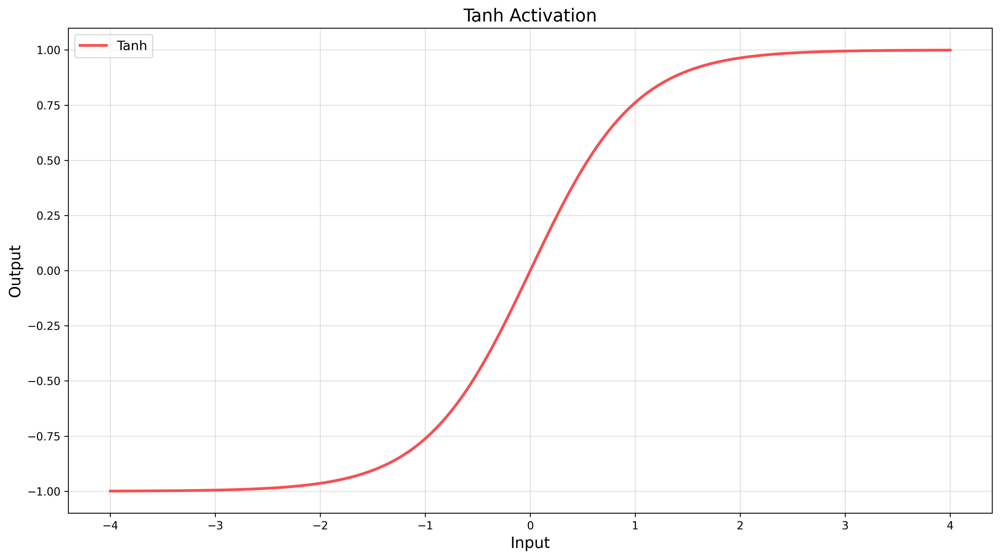
$$
\tanh(x) = \frac{e^x - e^{-x}}{e^x + e^{-x}}
$$
Tanh函数在神经网络中常用于隐藏层的激活函数，将输入映射到(-1,1)之间，可以提供更广泛的输出范围，有利于神经网络的学习。

**优点**:

- 输出值域 (-1,1)，零中心化特征分布
- 梯度强度是 Sigmoid 的 4 倍（最大梯度为1）

**缺点**:
- Tanh函数的输出范围仍然有限，可能在某些情况下导致梯度爆炸或梯度消失问题。
- Tanh函数与Sigmoid函数同样存在梯度饱和问题,当input处于边缘值时，梯度会接近于0，此时训练迭代慢。

### ReLu

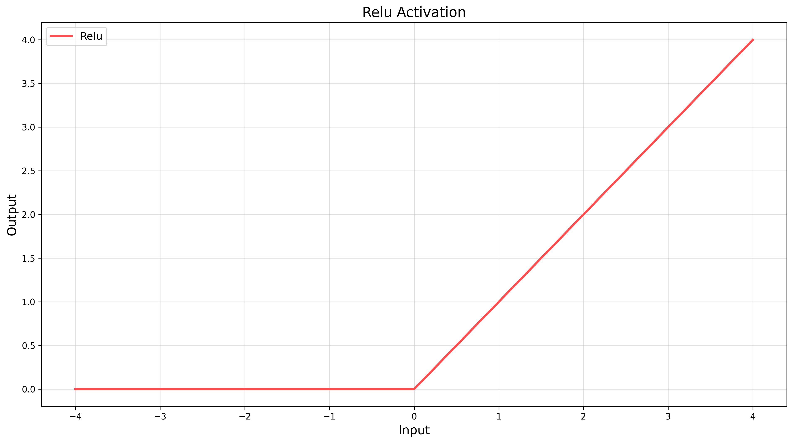
$$
f(x) = \max(0, x)
$$
它将输入的实数映射到大于等于零的范围，如果输入小于零，则输出为零；如果输入大于零，则输出与输入相同。

**优点**：

- ReLU函数在输入大于零时，梯度恒为1，不会饱和，避免了梯度消失问题，有利于加速训练过程
- 计算简单，时间复杂度为O(1)

**缺点：**

- ReLU函数在输入小于零时，导数为零，称为“神经元死亡”，可能导致对应神经元永远无法激活，称为“ReLU死亡”问题

### Leaky_ReLu

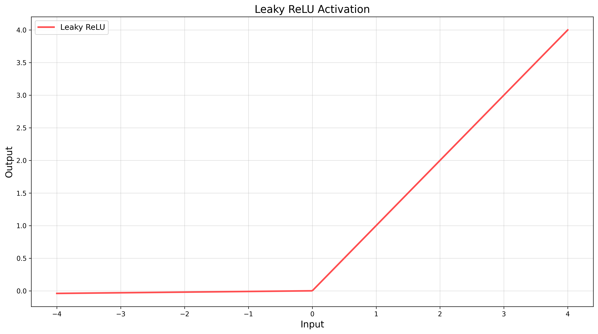
$$
f(x) = \begin{cases} 
x & x \geq 0 \\
\alpha x & x < 0 
\end{cases} \quad (\alpha \text{ 通常取 } 0.01)
$$
Leaky ReLU函数在神经网络中用于隐藏层的激活函数，能够解决ReLU函数在负数部分输出为零的问题，避免“神经元死亡”的情况。

**优点**:

- 解决了ReLU函数在负数部分输出为零的问题，避免了“神经元死亡”的情况
- 保留了ReLU函数的大部分优点，计算简单，不会出现梯度爆炸问题

**缺点**:

- 需要额外的参数a，需要手动调整或者通过训练学习，可能增加了模型的复杂性
- 当a的值选择不当时，可能会导致模型性能下降

### Elu

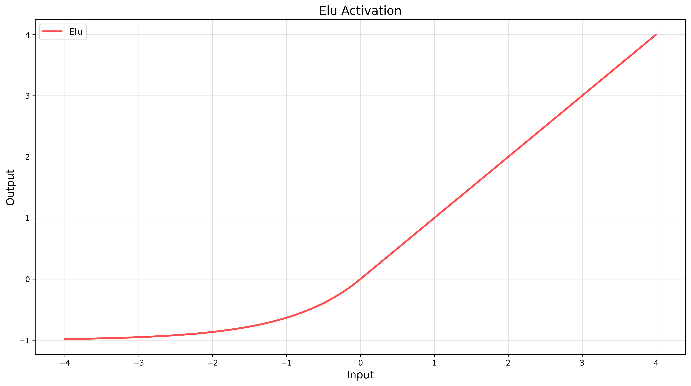
$$
f(x) = \begin{cases} 
x & x \geq 0 \\
\alpha ·(exp(x)-1) & x < 0 
\end{cases} \quad
$$
ELU函数结合了ReLU的优点，并且解决了ReLU函数在负数部分输出为零的问题。

**优点：**

- 缓解神经元死亡问题：在输入大于零时，ELU函数的导数始终为1，避免了ReLU函数的“神经元死亡”问题，有利于加速训练。在输入小于等于零时，ELU函数不会输出零，解决了ReLU函数的“神经元死亡”问题，增强了模型的稳定性。

**缺点：**

- ELU函数相对复杂，计算代价较高

### PReLU

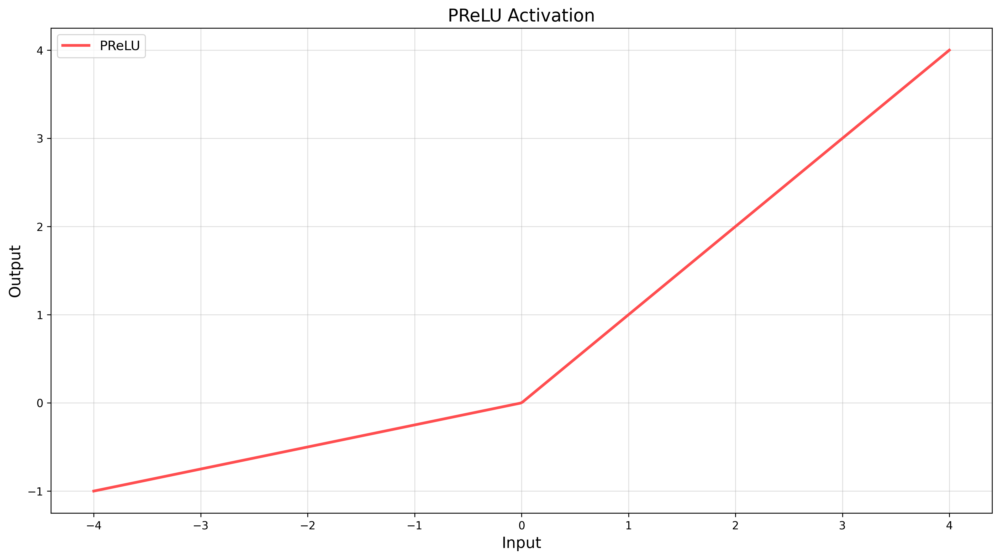
$$
f(x) = \begin{cases} 
x & x \geq 0 \\
\alpha x & x < 0 
\end{cases} \quad (\alpha \text{ 通常来自训练拟合的，不像leakyrelu直接固定}) 
$$
注意点：**与Leaky ReLU函数不同的是，Parametric ReLU函数的斜率是通过训练得到的**

Parametric ReLU函数在神经网络中用于隐藏层的激活函数，与ReLU和Leaky ReLU相比，其斜率可以通过训练过程中学习得到，具有更强的灵活性。即公式中的α是来自训练过程中的，而不是预先定义的；

**优点：**

- 可以通过学习得到参数a，具有更强的灵活性，可以根据任务自动调整斜率

- 解决了ReLU函数输出为零和Leaky ReLU函数固定斜率的问题

**缺点：**

- 需要额外的参数a，增加了模型的复杂度
- 需要更多的计算资源和训练时间，可能导致训练过程更加复杂和耗时


### Swish

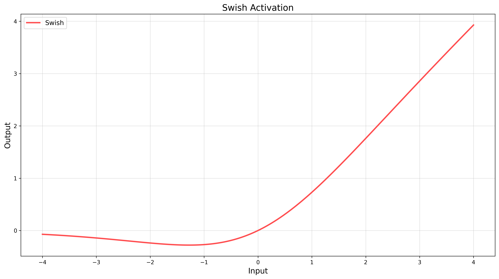
$$
f(x)=x·Sigmoid(x)
$$
Swish函数结合了线性性质和非线性性质，可以被视为是ReLU函数的平滑版本，一定程度上提升了模型的性能。

**优点：**

- Swish函数结合了ReLU函数的非线性性质和sigmoid函数的平滑性质，具有更好的性能表现。
- 相较于ReLU函数，Swish函数在一些情况下能够提供更好的结果。

**缺点：**

- Swish函数相对复杂，计算代价较高，可能增加模型的训练时间和资源消耗。

### Softmax

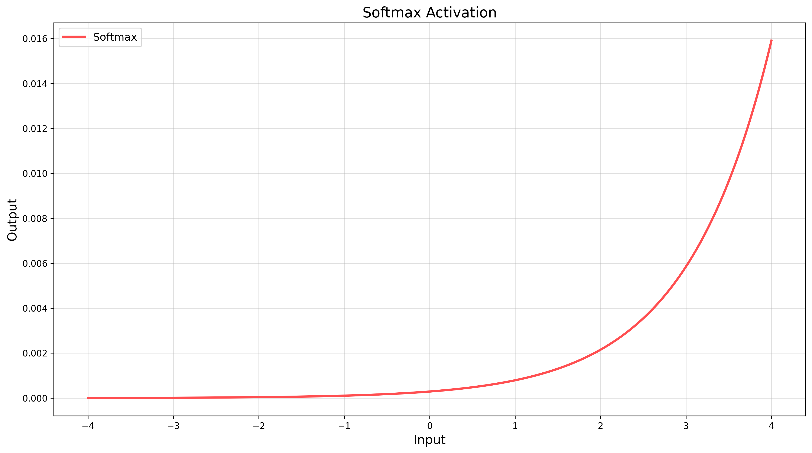
$$
\operatorname{Softmax}\left(x_{j}\right)=\frac{e^{x_{i}}}{\sum_{k=1}^{K} e^{x_{j}}}
$$
其中，$X_i$是输入向量的第$i$个元素，$K$是向量的长度。Softmax函数将输入向量的每个元素转化为一个概率值，使得所有元素的概率之和为1。

**优点：**

- 将神经网络的输出转化为概率分布，直观且易于理解
- 求解简单，可用于多分类问题

**缺点：**

- Softmax函数对输入的敏感度较高，可能在输入较大或较小时产生数值不稳定的情况
- Softmax函数的输出受到输入的所有元素的影响，可能导致类别之间的差异不够明显


### SoftPlus

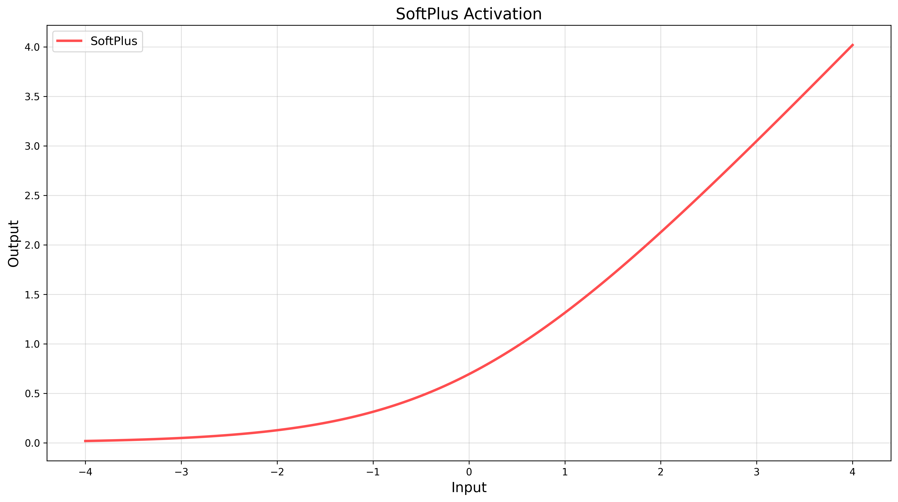
$$
f(x) = ln(1+e^{x})
$$
Softplus函数是ReLU函数的平滑版本，避免了ReLU在零点处不可导的问题，同时保留了ReLU函数的非线性特性。

**优点：**

- Softplus函数是ReLU函数的平滑版本，避免了ReLU在零点处不可导的问题
- 具有较好的非线性特性，在一些深度神经网络中表现良好

**缺点：**

- Softplus函数的计算较复杂，可能会增加模型的训练时间
- 当输入较大时，Softplus函数的输出接近线性关系，可能导致信息损失

### Maxout

$$
f(x) = max(w_1^{T}x+b_1,w_2^{T}x+b_2,...,w_k^{T}x+b_k)
$$

Maxout函数是一种激活函数，将输入的一组实数分成若干组，然后取每组的最大值作为输出。maxout的拟合能力是非常强的，它可以拟合任意的的凸函数。最直观的解释就是任意的凸函数都可以由分段线性函数以任意精度拟合，而maxout又是取k个隐隐含层节点的最大值，这些”隐隐含层"节点也是线性的，所以在不同的取值范围下，最大值也可以看做是分段线性的（分段的个数与k值有关）。Maxout是通过分段线性函数来拟合所有可能的凸函数来作为激活函数的，但是由于线性函数是可学习，所以实际上是可以学出来的激活函数。具体操作是对所有线性取最大，也就是把若干直线的交点作为分段的边界，然后每一段取最大。

最后，Maxout没有固定的激活函数图，其核心机制是通过对输入x进行多组线性变换然后取最大值得到的。由于每组线性变换的斜率$W_i$和偏移量$b_i$是可学习的参数，因此Maxout的曲线形态会随着训练过程而动态改变。

**优点**：

- Maxout函数具有更强的拟合能力，能够处理更复杂的非线性关系
- 相对于其他激活函数，Maxout函数可以通过学习参数来自适应地决定最大值的组合

**缺点：**

- Maxout函数的参数较多，可能增加了模型的复杂度和训练时间
- 对于小数据集或者低维数据，可能会出现过拟合的情况

### Mish

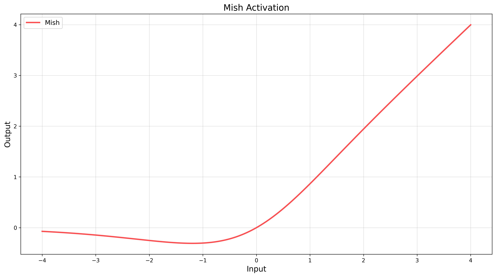
$$
f(x) = x·tanh(softplus(x))
$$
Mish函数常用作神经网络的激活函数，相比ReLU函数，在一些任务上表现更好。它结合了ReLU函数、tanh函数和softplus函数的优点。

**优点：**

- Mish函数在一些任务上表现更好，相比ReLU函数具有更强的拟合能力
- 结合了ReLU函数、tanh函数和softplus函数的优点，具有较好的非线性特性

**缺点：**

- Mish函数相对较复杂，计算代价较高，可能增加模型的训练时间
- 当输入较大时，Mish函数的输出可能接近线性关系，可能导致信息损失

### GELU

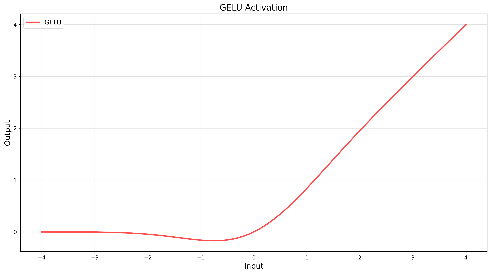
$$
f(x)=0.5 x\left(1+\tanh \left(\sqrt{\frac{2}{\pi}}\left(x+0.044715 x^{3}\right)\right)\right)
$$


GELU函数由OpenAI提出，被证明在一些NLP（自然语言处理）任务上效果良好。

**优点：**

- GELU函数在一些NLP任务中表现良好，具有较好的非线性特性
- 结合了高斯分布和非线性激活函数的优点，能够提升模型的性能

**缺点：**

- GELU函数相对复杂，计算代价较高，可能增加模型的训练时间

### 综合图

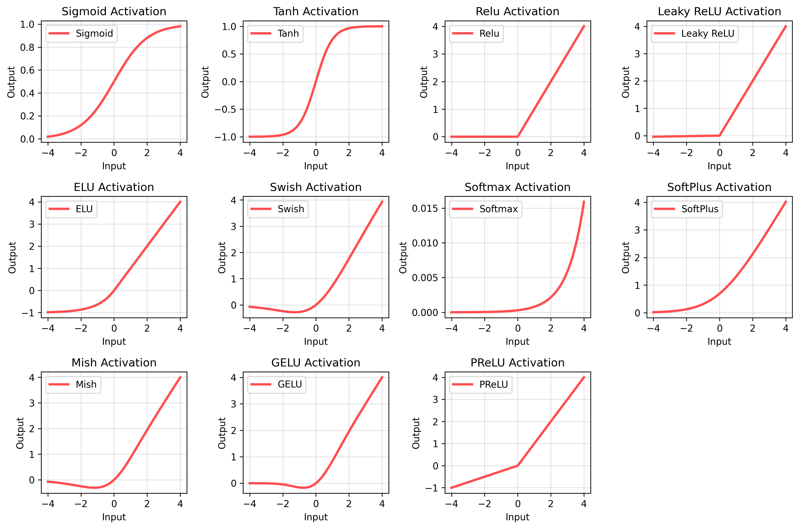

## 2.梯度消失或梯度爆炸解决方案

梯度消失和梯度爆炸问题都是因为网络太深，导致在反向迭代的过程中，某些部分存在连乘效应，一旦某些部分的值过大或过小时，网络权值更新不稳定造成的。所以梯度问题即梯度小时，梯度爆炸本质上是因为梯度反向传播中的连乘效应。以下归纳了6种解决方法：

1. 梯度裁剪：对梯度设定阈值【**仅梯度爆炸**】

   - **原理**：设定梯度阈值 *τ*，当梯度范数超过 *τ* 时进行缩放：

   $$
   g_{\text {clamped }}=\min \left(\frac{\tau}{\|g\|}, 1\right) \cdot g
   $$

   

   - **应用场景**：RNN、Transformer 等易发梯度爆炸的模型

   ****

2. 权重正则化【**间接缓解梯度爆炸**】

   - **L2 正则化**：约束权重范数，防止参数过大

   - **L1 正则化**：促进稀疏性，但可能加剧梯度消失

   - **数学形式**:
     $$
     L_{total} = L_{task} + \lambda\Sigma||w||^2
     $$

   ****

3. 选择合适的激活函数【**梯度爆炸，梯度消失**】

   - **梯度消失**：ReLU、Leaky ReLU、Swish（避免 Sigmoid/Tanh 的饱和区）
   - **梯度爆炸**：GELU、Softplus（平滑梯度，降低突变风险）

   ****

4. 增加BN层【**梯度爆炸，梯度消失**】

   - 标准化每层输入分布，减少内部协变量偏移（ICS）:
     $$
     \hat{x}=\frac{x-\mu}{\sqrt{\sigma^{2}+\epsilon}}, \quad y=\gamma \hat{x}+\beta
     $$
     **应用场景：**稳定梯度幅值，避免极端梯度值

     ****

5. 残差网络的捷径【**梯度消失**】

   - **原理**：通过跳跃连接保留原始梯度路径：
     $$
     y = F(x) + x
     $$
     **应用场景**：在梯度很小时，梯度可绕过深层网络直接传播，避免连乘效应。从而缓解梯度消失问题

     

     ****

6. LSTM的门结构【**梯度消失**】

   - 通过遗忘门、输入门、输出门控制信息流
     $$
     f_t = \sigma(W_f ·[h_{t-1},x_t]+b_f) (遗忘门) \\
     C_t = f_t \odot C_{t-1} + i_t \odot \tilde{C_t} ()
     $$
     允许梯度在时间步间稳定传播

     

   - **应用场景**：**RNN 中的梯度消失**

     ****

## 3.代码实现以及画图分析

github:https://github.com/VerdantE1/MachineLearning_Homework

ssh:git@github.com:VerdantE1/MachineLearning_Homework.git

```python
## ActivationFunction Module
import numpy as np
from math import erf,sqrt

def sigmoid(x):
    return 1/(1+np.exp(-x));

def tanh(x):
    return np.tanh(x)

def relu(x):
    return np.maximum(0, x)

def leaky_relu(x, alpha=0.01):
    return np.where(x >= 0, x, alpha * x)

def elu(x, alpha=1.0):
    return np.where(x >= 0, x, alpha * (np.exp(x) - 1))

def swish(x, beta=1):
    return x * sigmoid(beta * x)


def softmax(x):
    """Softmax 激活函数"""
    exp_x = np.exp(x - np.max(x, axis=-1, keepdims=True))
    return exp_x / np.sum(exp_x, axis=-1, keepdims=True)


def softplus(x):
    """SoftPlus 激活函数"""
    return np.log(1 + np.exp(x))


def maxout(x, feature_maps=2):
    """Maxout 激活函数 (简化版用于可视化)

    Parameters:
    -----------
    x : array-like
        输入张量
    feature_maps : int, default=2
        特征图的数量，默认为2

    Note: 这是一个为了可视化而简化的实现，仅展示maxout的基本思想
    """
    # 为了可视化，我们可以通过对x应用不同的线性变换来模拟特征图
    # 创建feature_maps个不同的线性变换
    transformed = []
    for i in range(feature_maps):
        # 使用不同的斜率和偏移来创建不同的线性变换
        slope = 0.5 + i  # 每个特征图有不同的斜率
        offset = -i  # 每个特征图有不同的偏移
        transformed.append(slope * x + offset)

    # 将所有变换堆叠起来，形状变为 (feature_maps, len(x))
    stacked = np.stack(transformed, axis=0)

    # 在第一个维度上取最大值（即在所有特征图中选择最大的值）
    return np.max(stacked, axis=0)

def mish(x):
    """Mish 激活函数"""
    return x * np.tanh(np.log(1 + np.exp(x)))

def gelu(x):
    """GELU 激活函数的近似版本"""
    # This approximation doesn't use erf and should work better with arrays
    return 0.5 * x * (1 + np.tanh(np.sqrt(2/np.pi) * (x + 0.044715 * np.power(x, 3))))

def prelu(x, alpha=0.25):
    """PReLU 激活函数 (Parametric ReLU)"""
    return np.where(x >= 0, x, alpha * x)


```


```python
# DrawingTool Module
from ActivationFunction import sigmoid,tanh,relu,leaky_relu,elu,swish,softmax,softplus,mish,gelu,prelu,maxout
import numpy as np
import matplotlib.pyplot as plt
import matplotlib

def plot_activation_function(func_dict,x_range=(-4,4),figsize=(12,8)):
    """
    :param func_dic:
    :param x_range:
    :param figsize:
    """
    matplotlib.use('TkAgg')  # 或者尝试 'TkAgg'、'Qt5Agg' 等
    x = np.linspace(x_range[0],x_range[1],500)

    # 自动计算子图布局
    num_plots = len(func_dict)
    rows = int(np.sqrt(num_plots))
    cols = int(np.ceil(num_plots / rows))

    # 创建全局大图（包含所有子图）
    global_fig = plt.figure(figsize=figsize)

    # 4K分辨率的设置 (3840x2160)
    dpi = 300
    single_figsize = (3840 / dpi, 2160 / dpi)

    # 动态生成图
    for idx, (name, (func, display_name, color)) in enumerate(func_dict.items(), 1):
        # 在大图中添加子图
        plt.figure(global_fig.number)
        plt.subplot(rows, cols, idx)
        plt.plot(x, func(x), label=display_name, c=color, lw=2.5)
        plt.title(f"{display_name} Activation")
        plt.xlabel("Input")
        plt.ylabel("Output")
        plt.grid(visible=True, alpha=0.4)
        plt.legend()

        # 为每个激活函数单独创建一个4K高清图
        single_fig = plt.figure(figsize=single_figsize, dpi=dpi)
        plt.plot(x, func(x), label=display_name, c=color, lw=2.5)
        plt.title(f"{display_name} Activation", fontsize=16)
        plt.xlabel("Input", fontsize=14)
        plt.ylabel("Output", fontsize=14)
        plt.grid(visible=True, alpha=0.4)
        plt.legend(fontsize=12)
        plt.tight_layout()
        # 保存单独的高清图像
        plt.savefig(f"./png/4k_{display_name}.png", dpi=dpi, bbox_inches='tight')
        plt.close(single_fig)  # 关闭单独的图，避免内存问题

    # 返回到全局大图
    plt.figure(global_fig.number)
    plt.tight_layout()
    # 保存全局大图
    plt.savefig(f"./png/all_activation_functions.png", dpi=dpi, bbox_inches='tight')

    # 展示全局大图
    plt.show()


if __name__ == '__main__':
    activation_funcs = {
        "sigmoid": (sigmoid, "Sigmoid", "#FF4E50"),
        "tanh": (tanh, "Tanh", "#FF4E50"),
        "relu": (relu, "Relu", "#FF4E50"),
        "leaky_relu": (leaky_relu, "Leaky ReLU", "#FF4E50"),
        "elu": (elu, "ELU", "#FF4E50"),
        "swish": (swish, "Swish", "#FF4E50"),
        "softmax": (softmax, "Softmax", "#FF4E50"),
        "softplus": (softplus, "SoftPlus", "#FF4E50"),
        "mish": (mish, "Mish", "#FF4E50"),
        "gelu": (gelu, "GELU", "#FF4E50"),
        "prelu": (prelu, "PReLU", "#FF4E50"),
        "maxout": (lambda x: maxout(x, feature_maps=2), "Maxout", "#FF4E50"),
    }

    plot_activation_function(activation_funcs)
```


